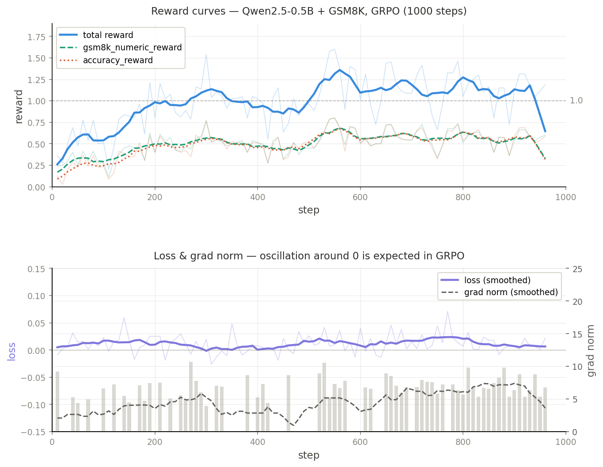

# 用 GRPO 在 GSM8K 上微调 Qwen2.5-0.5B：一次完整的复现记录

> 本文记录了在单张 RTX 4090D（24G）上，用 TRL 的 GRPOTrainer 对 Qwen2.5-0.5B-Instruct 进行数学推理强化学习微调的完整过程，包括踩坑、实验设计和训练曲线分析。代码全部开源。

---

## 背景：为什么是 GRPO

目前主流的 RLHF 路线基于 PPO，核心组件有四个：policy model、reference model、reward model、value model。其中 value model 的训练和维护成本相当高——它需要与 policy model 同等规模，内存占用直接翻倍。

DeepSeek-R1 技术报告中采用了 GRPO（Group Relative Policy Optimization），核心思路是**省掉 value model**。具体做法：对同一个 prompt 采样一组输出（group），用组内的相对奖励替代 value function 估计的 baseline。

数学上，GRPO 的优势函数估计为：

$$\hat{A}_{i,t} = \frac{r_i - \text{mean}(\mathbf{r})}{\text{std}(\mathbf{r})}$$

其中 $\mathbf{r}$ 是同组所有输出的 reward 向量。相比 PPO 需要单独训练 critic 来估计 $V(s)$，GRPO 直接用组内均值做 baseline，实现更简洁，显存占用更低。

---

## 实验设置

| 项目 | 配置 |
|------|------|
| 基座模型 | Qwen2.5-0.5B-Instruct |
| 训练数据 | GSM8K train split（7473 条） |
| 训练框架 | TRL `GRPOTrainer` |
| 硬件 | RTX 4090D 24G × 1 |
| 训练步数 | 1000 steps |
| per_device_train_batch_size | 8 |
| num_generations | 8 |
| max_completion_length | 256 |

**Reward 函数设计：**

用了两个并行的 reward 函数，最终奖励为两者之和：

1. **`gsm8k_numeric_reward`**（自定义）：用正则提取输出中最后一个数字，与 GSM8K 标准答案（`####` 后的数字）做字符串匹配。对格式容忍度高，只要输出了正确的数值就给分。

2. **`accuracy_reward`**（TRL 内置）：使用 `sympy.parse` 做符号化解析，精度更高，但对输出格式更敏感，要求答案以特定形式呈现。

两个函数互为补充：前者宽松，保证有足够的正向信号；后者严格，鼓励模型学习规范的答案格式。

---

## 踩坑记录

### 坑 1：数据集格式不对齐

TRL 的 `accuracy_reward` 期望输入字段为 `completions`（list of dicts）和 `solution`（字符串）。GSM8K 的原始字段是 `question` 和 `answer`，需要显式做 map：

```python
def preprocess(example):
    return {
        "prompt": [{"role": "user", "content": example["question"]}],
        "solution": example["answer"],
    }
dataset = dataset.map(preprocess)
```

跳过这步会导致 `reward_func` 收到字符串而不是字典列表，抛出 `TypeError: string indices must be integers`。

### 坑 2：num_generations 与 batch_size 的整除约束

GRPOConfig 要求 `generation_batch_size`（即 `per_device_train_batch_size`）必须能被 `num_generations` 整除。

```
ValueError: generation_batch_size (4) must be divisible by num_generations (8).
```

解决方法：将 `per_device_train_batch_size` 设为与 `num_generations` 相同的值（本实验均为 8）。

### 坑 3：num_generations 太小导致训练信号弱

初始实验用 `num_generations=2`，观察到 `frac_reward_zero_std` 持续在 0.55–0.80 之间，说明大多数 batch 内组内 reward 方差为 0——所有采样的输出 reward 相同，GRPO 的梯度退化为 0，模型不更新。

调整为 `num_generations=8` 后，`frac_reward_zero_std` 降至 0.2–0.4，有效训练 batch 比例明显提升。

**这是 GRPO 的一个内在约束**：组内需要足够的多样性才能产生有效的相对奖励信号。`num_generations` 过小相当于在做单点估计，组内对比失效。

---

## 训练曲线分析

训练 1000 步，以下是关键指标的变化趋势：



### Reward 上升

| 阶段 | total reward 均值 |
|------|-------------------|
| step 10–50 | 0.36–0.69 |
| step 50–200 | 0.5–0.96 |
| step 200–500 | 0.8–1.54 |
| step 500–1000 | 1.0–1.6 |

从 step ~190 开始，total reward 稳定突破 1.0，最高达到 1.6（两个 reward 函数各 0.8）。

### Entropy 下降

`entropy` 从初始的 ~0.39 单调下降至 ~0.14，说明模型输出分布越来越集中。结合 reward 上升来看，模型在学会输出正确答案的同时，也在收敛到固定的输出模式。

值得注意的是，entropy 下降过快可能导致**模式坍缩**（mode collapse）：模型对所有题目都输出相似的格式，即使内容错误。本实验在 1000 步内没有观察到这个现象，但在更长训练或更大 `num_generations` 的情况下需要监控。

### completions/clipped_ratio 下降

`clipped_ratio` 从初始的 ~0.7 下降至 ~0.1，说明模型输出越来越少地被截断——早期模型不知道什么时候停，后期学会了在 max_completion_length 内结束输出。这是推理格式学习的一个侧面证据。

### Loss 曲线：GRPO 的 loss 不是普通意义上的 loss


(loss)[./training_curves.png]

GRPO 的 loss 定义与监督学习有本质区别，这是容易误读的地方。

TRL 日志中的 `loss` 是 GRPO 目标函数的负值，其符号和绝对值意义不同于交叉熵 loss：

- **正值**：policy 相对 reference model 有明显偏移，clip 机制在起作用
- **负值**：policy 更新方向与 reward 信号对齐，梯度被 clip 抑制
- **接近 0**：当 `grad_norm=0` 时，该 batch 的 reward_std=0，GRPO 梯度为零，参数未更新

观察实际数据，前 300 步 loss 在 -0.02 到 +0.06 之间剧烈震荡，与 `grad_norm` 的波动（0 到 10+）一致。这是正常现象，不代表训练不稳定——GRPO 的更新是稀疏的，只有组内 reward 有差异的 batch 才会产生有效梯度。

**`grad_norm=0` 出现频率**是比 loss 本身更有诊断价值的指标。在本实验中，约 30–40% 的 step 出现 `grad_norm=0`，对应 `frac_reward_zero_std` 较高的 batch。这部分 step loss 固定为 0，拉低了 loss 曲线的均值，但不影响模型学习——有效更新步数约为 600–700 步。

一个实用建议：**不要用 loss 下降来判断 GRPO 训练是否正常**，应该看 `reward/mean` 是否上升，以及 `frac_reward_zero_std` 是否在可接受范围（<0.5）。

### 两个 Reward 函数的差异

训练初期，`gsm8k_numeric_reward` 持续高于 `accuracy_reward`（~0.3 vs ~0.1），说明模型能算出正确的数字，但格式不规范，TRL 内置的符号解析器解析失败。

训练约 130 步后，两者趋于一致，说明模型逐渐学会了按规范格式输出答案。这个观察支持一个结论：**在 GSM8K 上，格式学习先于精度学习，但两者是共同演化的**。

---

## 代码

完整代码如下：

```python
"""GRPO training on GSM8K with Qwen2.5-0.5B-Instruct."""

import re
from pathlib import Path

from datasets import load_from_disk
from trl import GRPOConfig, GRPOTrainer
from trl.rewards import accuracy_reward as trl_accuracy_reward

PROJECT_ROOT = Path(__file__).resolve().parent
DATASET_PATH = str(PROJECT_ROOT / "datasets" / "gsm8k" / "train")
MODEL_PATH = str(PROJECT_ROOT / "models" / "Qwen" / "Qwen2___5-0___5B-Instruct")


def preprocess(example):
    return {
        "prompt": [{"role": "user", "content": example["question"]}],
        "solution": example["answer"],
    }


def load_train_dataset():
    return load_from_disk(DATASET_PATH).map(preprocess)


def extract_last_number(text):
    matches = re.findall(r"-?\d+(?:,\d{3})*(?:\.\d+)?", text)
    return matches[-1].replace(",", "") if matches else None


def gsm8k_numeric_reward(completions, solution, **kwargs):
    rewards = []
    for completion, sol in zip(completions, solution):
        content = completion[0]["content"] if isinstance(completion, list) else completion
        predicted = extract_last_number(content)
        expected = extract_last_number(sol.split("####")[-1])
        rewards.append(1.0 if predicted is not None and predicted == expected else 0.0)
    return rewards


def accuracy_reward(completions, solution, **kwargs):
    if completions and isinstance(completions[0], str):
        completions = [[{"role": "assistant", "content": c}] for c in completions]
    return trl_accuracy_reward(completions=completions, solution=solution, **kwargs)


def main():
    trainer = GRPOTrainer(
        model=MODEL_PATH,
        args=GRPOConfig(
            output_dir="grpo-checkpoints",
            max_steps=1000,
            per_device_train_batch_size=8,
            num_generations=8,
            max_completion_length=256,
            bf16=True,
            logging_steps=10,
        ),
        reward_funcs=[gsm8k_numeric_reward, accuracy_reward],
        train_dataset=load_train_dataset(),
    )
    trainer.train()


if __name__ == "__main__":
    main()
```

---

## 结论

1. **GRPO 在单卡 24G 上是可行的**，Qwen2.5-0.5B + GSM8K 1000 步约 95 分钟。

2. **num_generations 是 GRPO 最关键的超参之一**。设置过小（=2）会导致组内方差为 0，训练信号完全消失。建议至少设为 8。

3. **双 reward 函数的设计有实际价值**。宽松的数值匹配保证了早期训练有信号，严格的符号解析引导模型学习规范格式。两者从 step ~130 开始趋于一致，可以作为模型格式收敛的一个观测指标。

4. **entropy 是监控训练健康度的重要指标**，过快下降需警惕模式坍缩。

5. **GRPO 的 loss 不适合作为训练质量的判断标准**。loss 震荡、符号交替、频繁出现 0 都是正常的。真正应该监控的是 `reward/mean` 的趋势和 `frac_reward_zero_std` 的比例。

---

*实验环境：AutoDL RTX 4090D，TRL 最新版，Qwen2.5-0.5B-Instruct via ModelScope。*
